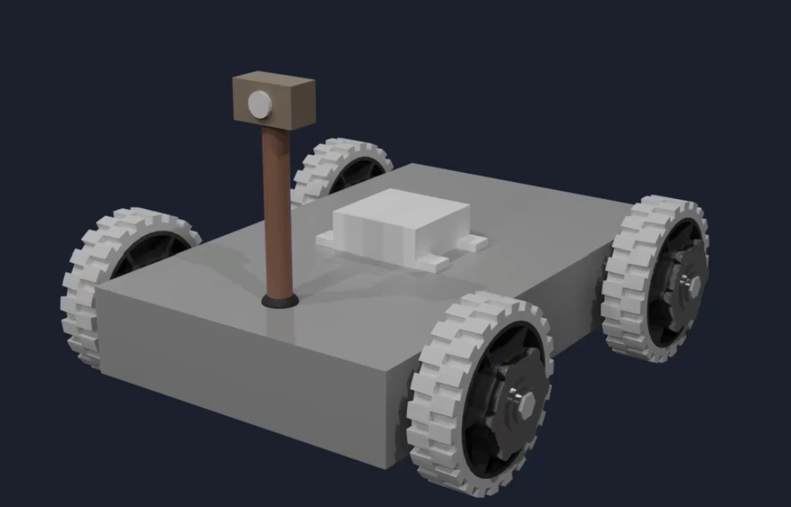

# Wheel Rotation Measurement and Control in a Mobile Robot using ROS

---

## 📌 Problem Statement

Design and implement a ROS-based system for a mobile robot that can accurately measure and control the rotation of its wheels. The system should detect and report how many times each wheel rotates (revolutions per minute, rpm). The rotation data must be published to a ROS topic via a publisher node. Another subscriber node should receive this data and use it to set or adjust a chosen parameter of the robot, such as its speed, based on the measured wheel rotation value. Optionally, experiment with integrating a neural network for advanced tuning or control functionalities, such as learning from the robot’s huggy fare behavior.

### ✅ Requirements
- Sense and calculate the rpm of each wheel in a mobile robot.  
- Create a ROS publisher node to publish the wheel rpm to a designated topic.  
- Develop a ROS subscriber node that uses the received rpm data to adjust the speed or another robot function.  

---

## 🖼️ System Diagram / Setup



---

## 🎥 Demo Video

<video src="Encoder_data_pub_sub.webm" controls autoplay loop muted width="700"></video>

---

## 🚀 Usage (Example)

Run the publisher node:
```bash
ros2 run encoder_pkg wheel_rpm_publisher
